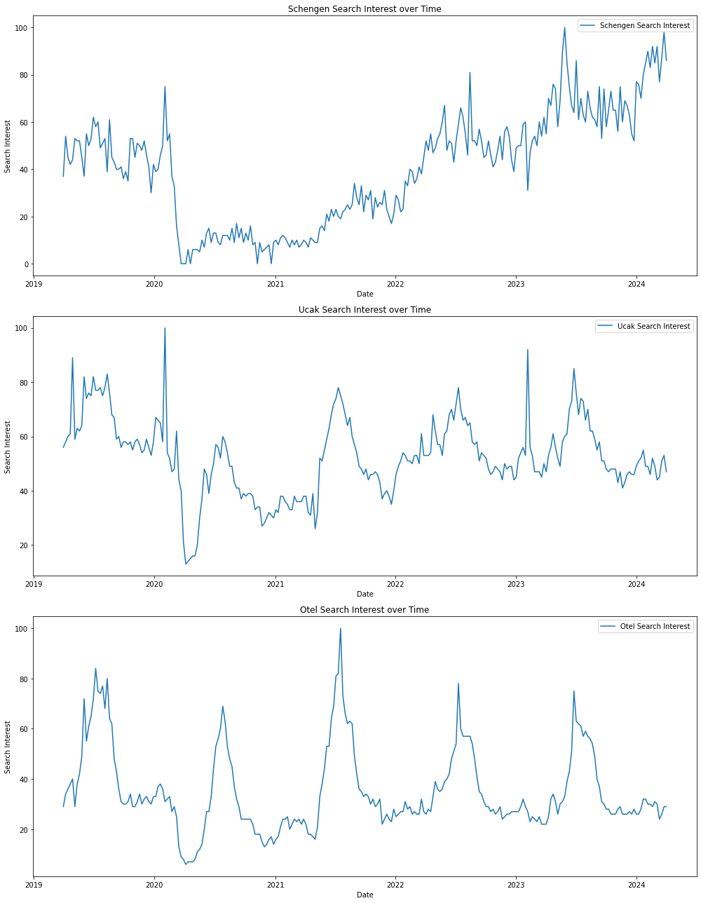
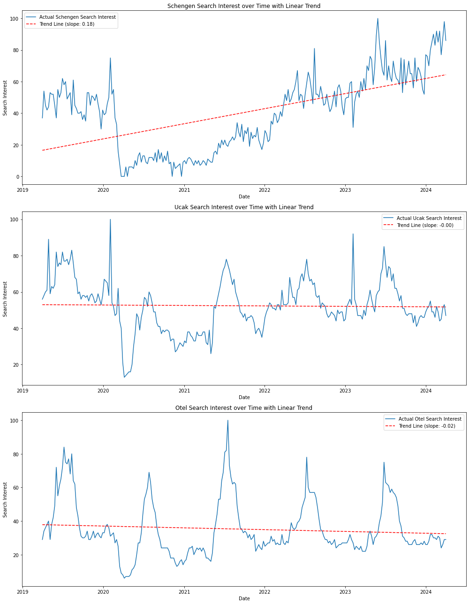
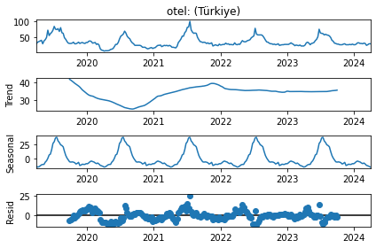
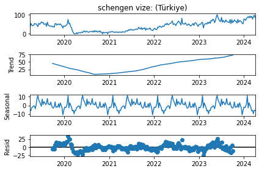
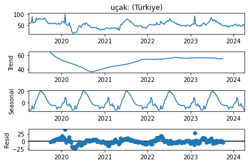
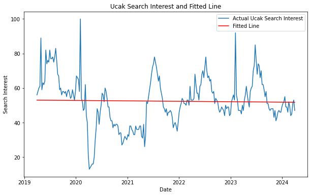
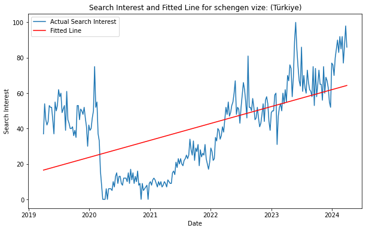
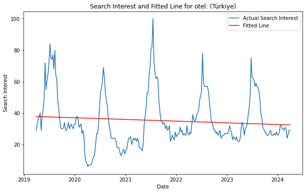
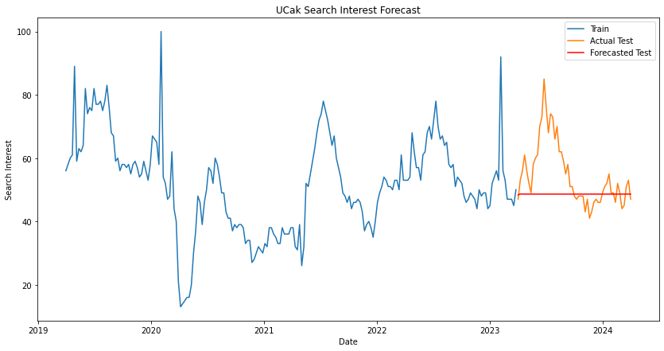

# INTRODUCTION

First of all, I asked the question of what the rate of going on vacation depends on and I saw that these could be related to the flight, hotel and Antalya. Then I selected the flight, hotel and Antalya data, but when I looked at the correlations between each pair, they were 0.5 and above, so I changed the approach a little and added Schengen instead of Antalya and European train instead of plane, but the correlation was still high. Finally I swapped plane and train and brought the correlations to the appropriate level. My idea here was that people should search for flights, visas (can we go to the destination country with Schengen?) and hotels on the same date while on holiday abroad. When I compared the time series I received, I saw that this was possible because the rise and fall periods of searches were approximately at the same time. Then, I applied the necessary approaches to statistically test the data I decided visually.


```python

import pandas as pd

# Paths to the uploaded files
paths = {
    "schengen": "schengen.csv",
    "ucak": "ucak.csv",
    "otel": "otel.csv"
}

# Load the datasets
dataframes = {}
for key, path in paths.items():
    dataframes[key] = pd.read_csv(path, skiprows=1)

# Inspect the first few rows of each to understand their structure
for key, df in dataframes.items():
    print(f"First few rows of {key}:")
    print(df.head(), "\n")


```

    First few rows of schengen:
            Hafta  schengen vize: (Türkiye)
    0  2019-03-31                        37
    1  2019-04-07                        54
    2  2019-04-14                        45
    3  2019-04-21                        42
    4  2019-04-28                        44 
    
    First few rows of ucak:
            Hafta  uçak: (Türkiye)
    0  2019-03-31               56
    1  2019-04-07               58
    2  2019-04-14               60
    3  2019-04-21               61
    4  2019-04-28               89 
    
    First few rows of otel:
            Hafta  otel: (Türkiye)
    0  2019-03-31               29
    1  2019-04-07               34
    2  2019-04-14               36
    3  2019-04-21               38
    4  2019-04-28               40 
    


```python
# Data Preparation
for key, df in dataframes.items():
    df['Hafta'] = pd.to_datetime(df['Hafta'])
    df.set_index('Hafta', inplace=True)

# Visualization
import matplotlib.pyplot as plt

plt.figure(figsize=(14, 18))

for i, (key, df) in enumerate(dataframes.items(), 1):
    plt.subplot(3, 1, i)
    plt.plot(df.index, df.iloc[:, 0], label=f'{key.capitalize()} Search Interest')
    plt.title(f'{key.capitalize()} Search Interest over Time')
    plt.xlabel('Date')
    plt.ylabel('Search Interest')
    plt.legend()

plt.tight_layout()
plt.show()


```


    

    


# Correlation Check


```python
# Correlation Analysis
# First, ensure all dataframes have the same date range for a fair comparison
common_index = dataframes['schengen'].index.intersection(dataframes['ucak'].index).intersection(dataframes['otel'].index)

# Align dataframes to the common index
aligned_dfs = {key: df.reindex(common_index) for key, df in dataframes.items()}

# Combine into a single dataframe for correlation analysis
combined_df = pd.concat(aligned_dfs, axis=1)

# Calculate correlations
correlations = combined_df.corr()

# Display the correlation matrix
correlations

```


<div>
<style scoped>
    .dataframe tbody tr th:only-of-type {
        vertical-align: middle;
    }

    .dataframe tbody tr th {
        vertical-align: top;
    }

    .dataframe thead tr th {
        text-align: left;
    }
</style>
<table border="1" class="dataframe">
  <thead>
    <tr>
      <th></th>
      <th></th>
      <th>schengen</th>
      <th>ucak</th>
      <th>otel</th>
    </tr>
    <tr>
      <th></th>
      <th></th>
      <th>schengen vize: (Türkiye)</th>
      <th>uçak: (Türkiye)</th>
      <th>otel: (Türkiye)</th>
    </tr>
  </thead>
  <tbody>
    <tr>
      <th>schengen</th>
      <th>schengen vize: (Türkiye)</th>
      <td>1.000000</td>
      <td>0.488479</td>
      <td>0.224439</td>
    </tr>
    <tr>
      <th>ucak</th>
      <th>uçak: (Türkiye)</th>
      <td>0.488479</td>
      <td>1.000000</td>
      <td>0.801711</td>
    </tr>
    <tr>
      <th>otel</th>
      <th>otel: (Türkiye)</th>
      <td>0.224439</td>
      <td>0.801711</td>
      <td>1.000000</td>
    </tr>
  </tbody>
</table>
</div>


# AIC&BIC


```python
from statsmodels.tsa.api import VAR

# Ensure data is stationary before applying VAR
model = VAR(combined_df.diff().dropna())
results = model.fit(maxlags=15, ic='aic')

# Summary of the model
print(results.summary())

# Forecasting
lag_order = results.k_ar
forecasted_values = results.forecast(combined_df.values[-lag_order:], steps=5)
print(forecasted_values)

```

    /Users/ahmetemregokalp/opt/anaconda3/lib/python3.8/site-packages/statsmodels/tsa/base/tsa_model.py:471: ValueWarning: No frequency information was provided, so inferred frequency W-SUN will be used.
      self._init_dates(dates, freq)


      Summary of Regression Results   
    ==================================
    Model:                         VAR
    Method:                        OLS
    Date:           Sat, 06, Apr, 2024
    Time:                     16:48:52
    --------------------------------------------------------------------
    No. of Equations:         3.00000    BIC:                    11.7325
    Nobs:                     258.000    HQIC:                   11.4855
    Log likelihood:          -2528.46    FPE:                    82412.4
    AIC:                      11.3194    Det(Omega_mle):         73527.1
    --------------------------------------------------------------------
    Results for equation schengen_schengen vize: (Türkiye)
    =======================================================================================================
                                              coefficient       std. error           t-stat            prob
    -------------------------------------------------------------------------------------------------------
    const                                        0.313599         0.482815            0.650           0.516
    L1.schengen_schengen vize: (Türkiye)        -0.456865         0.063130           -7.237           0.000
    L1.ucak_uçak: (Türkiye)                     -0.039356         0.076896           -0.512           0.609
    L1.otel_otel: (Türkiye)                      0.311323         0.095013            3.277           0.001
    L2.schengen_schengen vize: (Türkiye)        -0.159457         0.068667           -2.322           0.020
    L2.ucak_uçak: (Türkiye)                      0.082732         0.084326            0.981           0.327
    L2.otel_otel: (Türkiye)                     -0.037152         0.097769           -0.380           0.704
    L3.schengen_schengen vize: (Türkiye)        -0.131929         0.061754           -2.136           0.033
    L3.ucak_uçak: (Türkiye)                      0.030235         0.077306            0.391           0.696
    L3.otel_otel: (Türkiye)                     -0.072556         0.096906           -0.749           0.454
    =======================================================================================================
    
    Results for equation ucak_uçak: (Türkiye)
    =======================================================================================================
                                              coefficient       std. error           t-stat            prob
    -------------------------------------------------------------------------------------------------------
    const                                       -0.084058         0.427637           -0.197           0.844
    L1.schengen_schengen vize: (Türkiye)        -0.001321         0.055915           -0.024           0.981
    L1.ucak_uçak: (Türkiye)                     -0.487358         0.068108           -7.156           0.000
    L1.otel_otel: (Türkiye)                      0.306428         0.084155            3.641           0.000
    L2.schengen_schengen vize: (Türkiye)         0.047784         0.060820            0.786           0.432
    L2.ucak_uçak: (Türkiye)                     -0.212541         0.074689           -2.846           0.004
    L2.otel_otel: (Türkiye)                      0.215821         0.086596            2.492           0.013
    L3.schengen_schengen vize: (Türkiye)         0.116321         0.054697            2.127           0.033
    L3.ucak_uçak: (Türkiye)                     -0.130300         0.068471           -1.903           0.057
    L3.otel_otel: (Türkiye)                      0.186735         0.085832            2.176           0.030
    =======================================================================================================
    
    Results for equation otel_otel: (Türkiye)
    =======================================================================================================
                                              coefficient       std. error           t-stat            prob
    -------------------------------------------------------------------------------------------------------
    const                                       -0.026088         0.349459           -0.075           0.940
    L1.schengen_schengen vize: (Türkiye)         0.001793         0.045693            0.039           0.969
    L1.ucak_uçak: (Türkiye)                      0.044490         0.055657            0.799           0.424
    L1.otel_otel: (Türkiye)                     -0.036851         0.068770           -0.536           0.592
    L2.schengen_schengen vize: (Türkiye)         0.006139         0.049701            0.124           0.902
    L2.ucak_uçak: (Türkiye)                      0.058531         0.061035            0.959           0.338
    L2.otel_otel: (Türkiye)                      0.153278         0.070765            2.166           0.030
    L3.schengen_schengen vize: (Türkiye)         0.002049         0.044698            0.046           0.963
    L3.ucak_uçak: (Türkiye)                      0.040249         0.055954            0.719           0.472
    L3.otel_otel: (Türkiye)                      0.103318         0.070140            1.473           0.141
    =======================================================================================================
    
    Correlation matrix of residuals
                                         schengen_schengen vize: (Türkiye)  ucak_uçak: (Türkiye)  otel_otel: (Türkiye)
    schengen_schengen vize: (Türkiye)                             1.000000              0.083657             -0.033391
    ucak_uçak: (Türkiye)                                          0.083657              1.000000              0.401304
    otel_otel: (Türkiye)                                         -0.033391              0.401304              1.000000
    
    
    
    [[-55.93981068  -6.21033499  14.21648194]
     [  6.20782998  17.66054501  12.12762532]
     [ -3.59290044   6.02690765   6.86010165]
     [ 10.03504342  -4.79705936   4.01777293]
     [ -3.17973783   4.18521393   2.98917325]]


# REGRESSION

I've applied a simple linear regression model to explore the trends in search interest over time. The trend line is plotted alongside the actual search interest to visualize the direction and rate of change.

The slope of the trend line provides a numeric representation of the trend's direction and intensity:

A positive slope indicates an increasing trend in search interest over time.
A negative slope would suggest a decreasing trend, although all depicted trends here appear to be either stable or increasing.

The magnitude of the slope indicates how quickly the search interest is increasing or decreasing.
This simplistic approach helps illustrate general trends but doesn't capture the full complexity of time series data, such as seasonality and potential non-linear patterns. For a more accurate forecast or deeper analysis, advanced time series modeling techniques, such as ARIMA (Autoregressive Integrated Moving Average), would be more appropriate.


```python
from sklearn.linear_model import LinearRegression
import numpy as np

# Prepare a function for linear regression on a time series
def linear_regression_on_time_series(df, column_name):
    # Transform the index to a numerical format (e.g., days since start)
    df['Time'] = np.arange(len(df.index))
    
    # Prepare the features (X) and target (y)
    X = df[['Time']]
    y = df[column_name]
    
    # Initialize and fit the linear regression model
    model = LinearRegression()
    model.fit(X, y)
    
    # Predict the values using the model
    predictions = model.predict(X)
    
    # Calculate the trend line
    trend_line = model.intercept_ + model.coef_[0] * X['Time']
    
    return predictions, trend_line, model.coef_[0]

# Apply the linear regression model to each dataset and plot the results
plt.figure(figsize=(14, 18))

for i, (key, df) in enumerate(dataframes.items(), 1):
    column_name = df.columns[0]  # Assume the interest column is the first one
    predictions, trend_line, slope = linear_regression_on_time_series(df, column_name)
    
    plt.subplot(3, 1, i)
    plt.plot(df.index, df[column_name], label=f'Actual {key.capitalize()} Search Interest')
    plt.plot(df.index, trend_line, label=f'Trend Line (slope: {slope:.2f})', color='red', linestyle='--')
    plt.title(f'{key.capitalize()} Search Interest over Time with Linear Trend')
    plt.xlabel('Date')
    plt.ylabel('Search Interest')
    plt.legend()

plt.tight_layout()
plt.show()

```


    

    


# DECOMPOSITION

The decomposition reveals the trend, seasonal, and residual components of the time series data.


```python
from statsmodels.tsa.seasonal import seasonal_decompose
import matplotlib.pyplot as plt
# Corrected code to load and parse dates
otel_df = pd.read_csv('otel.csv', skiprows=1, parse_dates=['Hafta'], index_col='Hafta')
schengen_df = pd.read_csv('schengen.csv', skiprows=1, parse_dates=['Hafta'], index_col='Hafta')
ucak_df = pd.read_csv('ucak.csv', skiprows=1, parse_dates=['Hafta'], index_col='Hafta')


# Assuming 'otel_df' is already loaded and its index is set to datetime
otel_df.index = pd.to_datetime(otel_df.index)

# Decompose the time series
decomposition = seasonal_decompose(otel_df['otel: (Türkiye)'], model='additive', period=52)  # weekly data

# Plot the decomposed components
decomposition.plot()
plt.show()


from statsmodels.tsa.seasonal import seasonal_decompose

# Correct DataFrame and column name usage
decomposition = seasonal_decompose(schengen_df['schengen vize: (Türkiye)'], model='additive', period=52)

# Plot the decomposed components
decomposition.plot()
plt.show()

#Correcting the column name based on previous insights
ucak_column_name = ucak_df.columns[0]  # Dynamically obtaining the column name

# Decomposing the ucak time series
from statsmodels.tsa.seasonal import seasonal_decompose

decomposition_ucak = seasonal_decompose(ucak_df[ucak_column_name], model='additive', period=52)

# Plotting the decomposed components for ucak dataset
decomposition_ucak.plot()
plt.show()

```


    

    


    

    


    

    


# Schengen Visa Search Interest:

### R-squared of 0.334: 
This indicates that approximately 33.4% of the variance in Schengen visa search interest is explained by the model, specifically by time.

### The coefficient for Time is positive (0.1832):
Indicating a general upward trend in search interest over time for Schengen visas.

### The model's p-value for the Time coefficient is significant (< 0.0001)
Suggesting a statistically significant relationship between time and search interest.

# Hotel Search Interest:

### R-squared of 0.009: 
A much lower value, suggesting that only 0.9% of the variance in hotel search interest is explained by time, 
indicating that the model does not capture the variations in hotel search interest well.

### The coefficient for Time is slightly negative (-0.0205)
Suggesting a very slight downward trend in search interest over time for hotels, though this trend is not statistically significant (p-value > 0.05).

# Airplane Search Interest:

### R-squared of 0.001: 
This very low value indicates that only 0.1% of the variance in airplane search interest is explained by time, suggesting that the time variable alone is not a strong predictor of search interest for airplanes.

### The coefficient for Time is slightly negative (-0.0048)
Indicating an almost flat trend, which is statistically not significant (p-value = 0.680). This implies that there's no significant upward or downward trend in search interest for airplanes over the period analyzed. The model's lack of significance is further supported by the high p-value associated with the Time coefficient, indicating that changes in time do not significantly affect the search interest for airplanes.


# Observations and Next Steps:

The analysis indicates a clearer trend and relationship between time and Schengen visa search interest compared to hotel search interest. This could reflect external factors influencing interest in Schengen visas over the studied period.

The low R-squared for the hotel search interest model suggests that time alone may not be a good predictor for this series, indicating the need for additional explanatory variables to better capture its variations.

Unlike the "schengen vize" and "otel" datasets, where there was some level of trend observed, the "uçak" dataset does not exhibit a significant trend over time based on this simple linear regression model.
This analysis highlights the importance of considering other factors or using more sophisticated time series models that can capture other patterns in the data beyond linear trends, such as seasonality, cyclical changes, or external events that may influence search interest.


```python
import pandas as pd
import matplotlib.pyplot as plt
from statsmodels.api import add_constant, OLS


# Ensure ucak_df is prepared with necessary cleaning steps
ucak_df.fillna(method='ffill', inplace=True)
ucak_df.replace([np.inf, -np.inf], np.nan, inplace=True)
ucak_df.dropna(inplace=True)

# Adding a 'Time' column for regression
ucak_df['Time'] = np.arange(len(ucak_df))

# Perform regression and plot for 'ucak: (Türkiye)'
ucak_column_name = ucak_df.columns[0]  # Dynamically obtaining the column name based on previous steps
X_ucak = ucak_df[['Time']]  # Explanatory variable
y_ucak = ucak_df[ucak_column_name]  # Dependent variable

X_ucak = add_constant(X_ucak)  # Add a constant to the model for the intercept

# Fit the model for ucak search interest
model_ucak = OLS(y_ucak, X_ucak).fit()

# Print model summary for ucak
print(model_ucak.summary())

# Plotting the actual data and the fitted line for ucak
plt.figure(figsize=(10, 6))
plt.plot(ucak_df.index, y_ucak, label='Actual Ucak Search Interest')
plt.plot(ucak_df.index, model_ucak.predict(X_ucak), label='Fitted Line', color='red')
plt.title("Ucak Search Interest and Fitted Line")
plt.xlabel('Date')
plt.ylabel('Search Interest')
plt.legend()
plt.show()


# For Schengen and Hotel
for df in [schengen_df, otel_df]:
    # Forward fill to handle NaNs, then drop any remaining ones
    df.fillna(method='ffill', inplace=True)
    df.dropna(inplace=True)

    # Replace Inf values with NaN, then drop those as well
    df.replace([np.inf, -np.inf], np.nan, inplace=True)
    df.dropna(inplace=True)

    # Adding a 'Time' column for regression
    df['Time'] = np.arange(len(df))


# Function to perform regression and plot results
def perform_regression_and_plot(df, target_column_name):
    X = df[['Time']]  # Explanatory variable
    y = df[target_column_name]  # Dependent variable

    X = add_constant(X)  # Add a constant to the model for the intercept
    
    model = OLS(y, X).fit()
    
    print(model.summary())  # Print model summary
    
    # Plotting the actual data and the fitted line
    plt.figure(figsize=(10, 6))
    plt.plot(df.index, y, label='Actual Search Interest')
    plt.plot(df.index, model.predict(X), label='Fitted Line', color='red')
    plt.title(f"Search Interest and Fitted Line for {target_column_name}")
    plt.xlabel('Date')
    plt.ylabel('Search Interest')
    plt.legend()
    plt.show()

# Perform regression and plot for 'schengen vize: (Türkiye)'
schengen_column_name = schengen_df.columns[0]  # Assuming the interest column is the first one
perform_regression_and_plot(schengen_df, schengen_column_name)

# Perform regression and plot for 'otel: (Türkiye)'
otel_column_name = otel_df.columns[0]  # Assuming the interest column is the first one
perform_regression_and_plot(otel_df, otel_column_name)

```

                                OLS Regression Results                            
    ==============================================================================
    Dep. Variable:        uçak: (Türkiye)   R-squared:                       0.001
    Model:                            OLS   Adj. R-squared:                 -0.003
    Method:                 Least Squares   F-statistic:                    0.1705
    Date:                Sat, 06 Apr 2024   Prob (F-statistic):              0.680
    Time:                        16:49:08   Log-Likelihood:                -1065.2
    No. Observations:                 262   AIC:                             2134.
    Df Residuals:                     260   BIC:                             2141.
    Df Model:                           1                                         
    Covariance Type:            nonrobust                                         
    ==============================================================================
                     coef    std err          t      P>|t|      [0.025      0.975]
    ------------------------------------------------------------------------------
    const         52.9897      1.745     30.373      0.000      49.554      56.425
    Time          -0.0048      0.012     -0.413      0.680      -0.028       0.018
    ==============================================================================
    Omnibus:                        3.586   Durbin-Watson:                   0.280
    Prob(Omnibus):                  0.166   Jarque-Bera (JB):                4.212
    Skew:                           0.048   Prob(JB):                        0.122
    Kurtosis:                       3.614   Cond. No.                         301.
    ==============================================================================
    
    Notes:
    [1] Standard Errors assume that the covariance matrix of the errors is correctly specified.


    

    


                                   OLS Regression Results                               
    ====================================================================================
    Dep. Variable:     schengen vize: (Türkiye)   R-squared:                       0.334
    Model:                                  OLS   Adj. R-squared:                  0.331
    Method:                       Least Squares   F-statistic:                     130.2
    Date:                      Sat, 06 Apr 2024   Prob (F-statistic):           1.03e-24
    Time:                              16:49:09   Log-Likelihood:                -1151.1
    No. Observations:                       262   AIC:                             2306.
    Df Residuals:                           260   BIC:                             2313.
    Df Model:                                 1                                         
    Covariance Type:                  nonrobust                                         
    ==============================================================================
                     coef    std err          t      P>|t|      [0.025      0.975]
    ------------------------------------------------------------------------------
    const         16.5265      2.422      6.825      0.000      11.758      21.295
    Time           0.1832      0.016     11.410      0.000       0.152       0.215
    ==============================================================================
    Omnibus:                       43.701   Durbin-Watson:                   0.198
    Prob(Omnibus):                  0.000   Jarque-Bera (JB):               14.904
    Skew:                           0.335   Prob(JB):                     0.000580
    Kurtosis:                       2.042   Cond. No.                         301.
    ==============================================================================
    
    Notes:
    [1] Standard Errors assume that the covariance matrix of the errors is correctly specified.


    

    


                                OLS Regression Results                            
    ==============================================================================
    Dep. Variable:        otel: (Türkiye)   R-squared:                       0.009
    Model:                            OLS   Adj. R-squared:                  0.005
    Method:                 Least Squares   F-statistic:                     2.295
    Date:                Sat, 06 Apr 2024   Prob (F-statistic):              0.131
    Time:                        16:49:09   Log-Likelihood:                -1106.6
    No. Observations:                 262   AIC:                             2217.
    Df Residuals:                     260   BIC:                             2224.
    Df Model:                           1                                         
    Covariance Type:            nonrobust                                         
    ==============================================================================
                     coef    std err          t      P>|t|      [0.025      0.975]
    ------------------------------------------------------------------------------
    const         37.8348      2.044     18.514      0.000      33.811      41.859
    Time          -0.0205      0.014     -1.515      0.131      -0.047       0.006
    ==============================================================================
    Omnibus:                       42.489   Durbin-Watson:                   0.116
    Prob(Omnibus):                  0.000   Jarque-Bera (JB):               58.543
    Skew:                           1.053   Prob(JB):                     1.94e-13
    Kurtosis:                       3.963   Cond. No.                         301.
    ==============================================================================
    
    Notes:
    [1] Standard Errors assume that the covariance matrix of the errors is correctly specified.


    

    


# Model Parameters:
### ARIMA(1,1,1): 
This specifies that the model is an Autoregressive Integrated Moving Average model with one autoregressive term (ar.L1), one differencing operation (implied by the I in ARIMA), and one moving average term (ma.L1).

### ar.L1 Coefficient (-0.2098): 
This coefficient is associated with the autoregressive term. Its value suggests a slight negative correlation with the previous value in the series, although the p-value (0.163) indicates that this coefficient is not statistically significant at conventional levels (e.g., 0.05 or 0.01).

### ma.L1 Coefficient (-0.1444): 
Associated with the moving average term, indicating a slight negative effect of the previous error term on the current value. Similar to the AR term, this coefficient is not statistically significant (p-value: 0.373).

## Model Fit and Diagnostics:

### Log Likelihood (-715.664): 
Measures the goodness of fit of the model. Higher values (less negative) indicate a better fit.

### AIC (1437.329), BIC (1447.341), HQIC (1441.377): 
These are information criteria that balance model fit and complexity. Lower values suggest a better model. When comparing models, you look for those with lower AIC/BIC values.
Sigma^2 (56.9917): This is the variance of the residuals. It gives you an idea of the variability in the model errors.

# Conclusions and Next Steps:

The model's AR and MA coefficients are not statistically significant, indicating they may not have a meaningful impact on the model.

The diagnostics suggest that the residuals of the model do not behave ideally (not normally distributed and 
exhibit heteroskedasticity).

Given these findings, you might consider alternative specifications for your ARIMA model, such as different orders, or exploring SARIMA models to account for seasonality explicitly.
Additional diagnostics and testing for stationarity (e.g., ADF test) and seasonality might provide further insights into the appropriate modeling approach.


```python
from statsmodels.tsa.arima.model import ARIMA
import matplotlib.pyplot as plt

# It's a good practice to split the data into train and test sets to evaluate the model's performance
train_size = int(len(ucak_df) * 0.8)
train, test = ucak_df[ucak_column_name][:train_size], ucak_df[ucak_column_name][train_size:]

# Fit the ARIMA model
# The order (p,d,q) needs to be chosen based on model diagnostics; we'll start with (1,1,1) as an example
model_arima = ARIMA(train, order=(1,1,1))
model_arima_fit = model_arima.fit()

# Forecast
forecast = model_arima_fit.forecast(steps=len(test))

# Plotting the actual vs forecasted values
plt.figure(figsize=(14, 7))
plt.plot(train.index, train, label='Train')
plt.plot(test.index, test, label='Actual Test')
plt.plot(test.index, forecast, label='Forecasted Test', color='red')
plt.title('UCak Search Interest Forecast')
plt.xlabel('Date')
plt.ylabel('Search Interest')
plt.legend()
plt.show()

# Print out the summary of the fit model
print(model_arima_fit.summary())


```

    /Users/ahmetemregokalp/opt/anaconda3/lib/python3.8/site-packages/statsmodels/tsa/base/tsa_model.py:471: ValueWarning: No frequency information was provided, so inferred frequency W-SUN will be used.
      self._init_dates(dates, freq)
    /Users/ahmetemregokalp/opt/anaconda3/lib/python3.8/site-packages/statsmodels/tsa/base/tsa_model.py:471: ValueWarning: No frequency information was provided, so inferred frequency W-SUN will be used.
      self._init_dates(dates, freq)
    /Users/ahmetemregokalp/opt/anaconda3/lib/python3.8/site-packages/statsmodels/tsa/base/tsa_model.py:471: ValueWarning: No frequency information was provided, so inferred frequency W-SUN will be used.
      self._init_dates(dates, freq)


    

    


                                   SARIMAX Results                                
    ==============================================================================
    Dep. Variable:        uçak: (Türkiye)   No. Observations:                  209
    Model:                 ARIMA(1, 1, 1)   Log Likelihood                -715.664
    Date:                Sat, 06 Apr 2024   AIC                           1437.329
    Time:                        16:49:21   BIC                           1447.341
    Sample:                    03-31-2019   HQIC                          1441.377
                             - 03-26-2023                                         
    Covariance Type:                  opg                                         
    ==============================================================================
                     coef    std err          z      P>|z|      [0.025      0.975]
    ------------------------------------------------------------------------------
    ar.L1         -0.2098      0.150     -1.394      0.163      -0.505       0.085
    ma.L1         -0.1444      0.162     -0.891      0.373      -0.462       0.173
    sigma2        56.9917      2.697     21.131      0.000      51.705      62.278
    ===================================================================================
    Ljung-Box (L1) (Q):                   0.00   Jarque-Bera (JB):               632.54
    Prob(Q):                              0.98   Prob(JB):                         0.00
    Heteroskedasticity (H):               0.49   Skew:                             1.06
    Prob(H) (two-sided):                  0.00   Kurtosis:                        11.28
    ===================================================================================
    
    Warnings:
    [1] Covariance matrix calculated using the outer product of gradients (complex-step).


# Conclusion

My question is whether the rate of people going on holiday abroad is related to Schengen, flights and hotel searches. According to my results, Schengen visa searches are more effective for holidays abroad because the R squared value is higher than others. However, although the hotel and flight variables behave seasonal and equivalent to Schengen in shape, they are not related because they have low r-squared values.


```python

```
